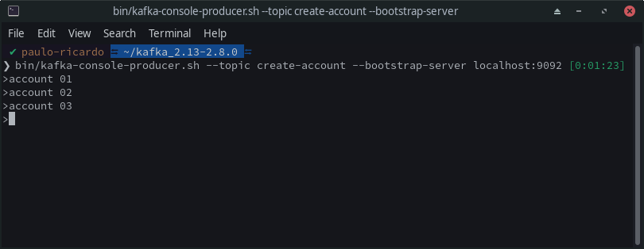

# Instalação Simples

## Configuração

**Passo 1:** devemos acessar o site [kafka.apache.org](https://kafka.apache.org/) e clicarmos na opção **"quickstart"**.

**Passo 2:** Realizar o download da versão mais atualizada (ou recomendada no site), e executar os seguintes comandos:

``
$ tar -xzf kafka_2.13-2.8.0.tgz
``

``
$ cd kafka_2.13-2.8.0
``

Após a execução devemos ter o resultado conforme imagem abaixo:

**Passo 3:** Iniciando o ambiente Kafka

*NOTA: Seu ambiente local deve ter o Java 8+ instalado.*

**3.1** Execute os seguintes comandos para iniciar todos os serviços na ordem correta:

\# Start the ZooKeeper service

\# Note: Soon, ZooKeeper will no longer be required by Apache Kafka.

``
$ bin/zookeeper-server-start.sh config/zookeeper.properties
``

Após a execução devemos ter o resultado conforme imagem abaixo:

A porta padrão de execução do zookeeper é a **2181** conforme log do console.

**3.2** Após a a excução do passo anterior, devemos abrir uma nova sessão ou janela do terminal e executar:

\# Start the Kafka broker service

``
$ bin/kafka-server-start.sh config/server.properties
``

Após a execução devemos ter o resultado conforme imagem abaixo:

## Criando um Tópico/Eventos

Criando um tópico (abra em outra sessão do terminal):

``
$ bin/kafka-topics.sh --create --topic create-account --bootstrap-server localhost:9092
``

Criando eventos em um tópico (se preferir, abra em outra sessão do terminal):

``
$ bin/kafka-console-producer.sh --topic create-account --bootstrap-server localhost:9092
``

Lendo eventos em um tópico (se preferir, abra em outra sessão do terminal):

``
bin/kafka-console-consumer.sh --topic create-account --from-beginning --bootstrap-server localhost:9092
``

Um detalhe importante é o argumento ``--from-beginning``, pois ele é quem determina que os eventos serão listados desde a partir da criação do tópico, caso contrário, só irão ser listados os eventos atuais.

Referências: [Kafka quickstart](https://kafka.apache.org/quickstart)